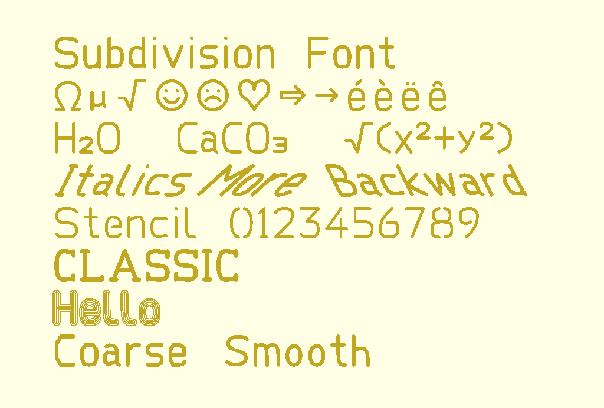
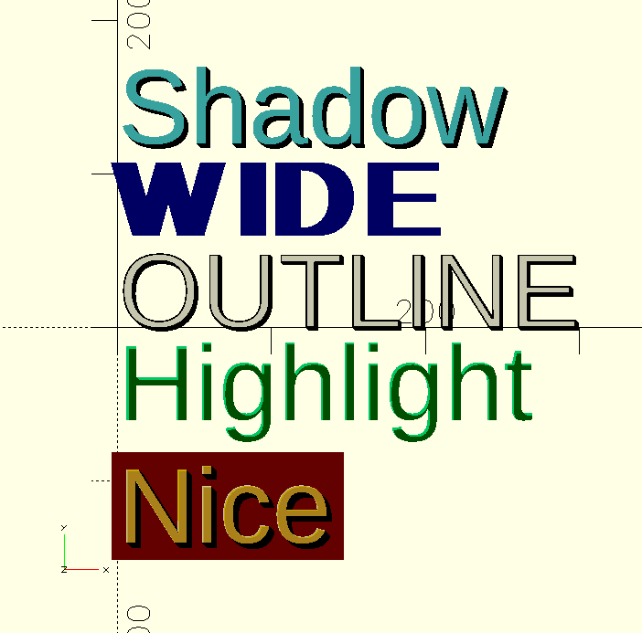
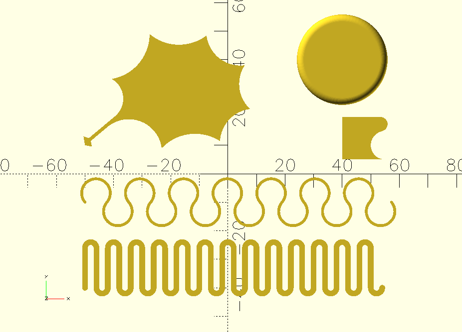
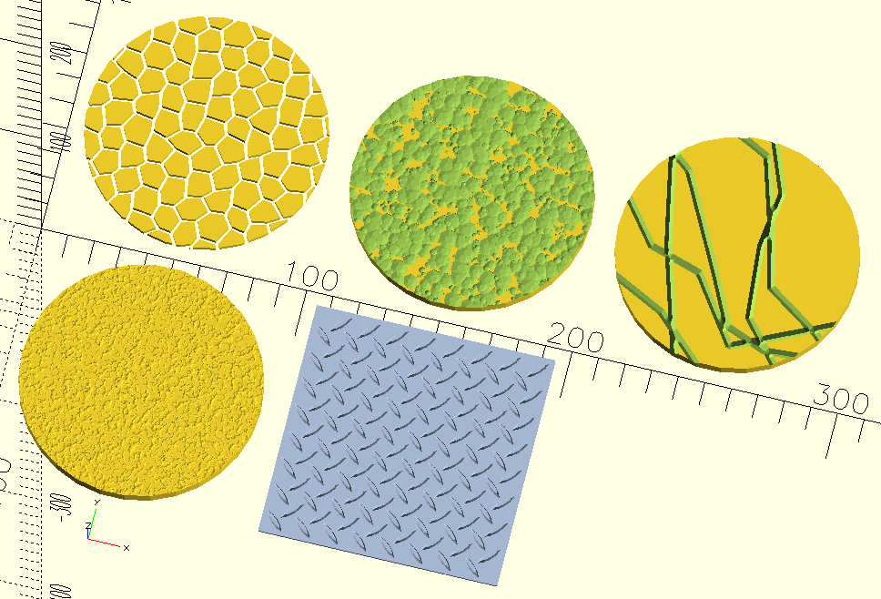
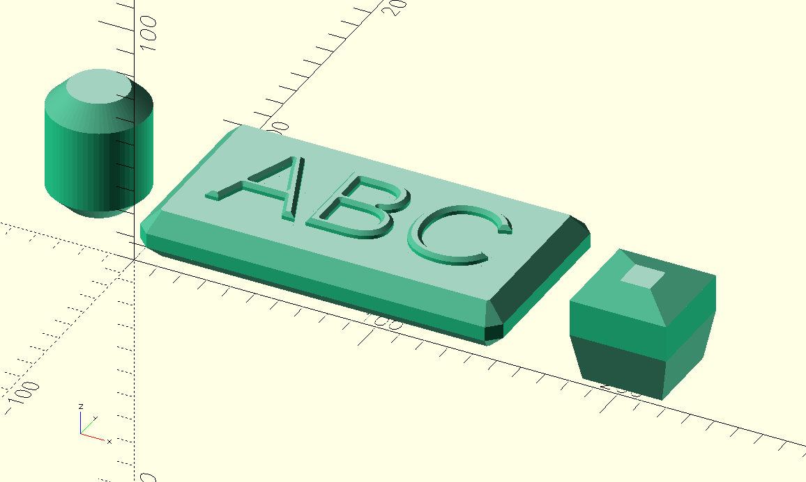
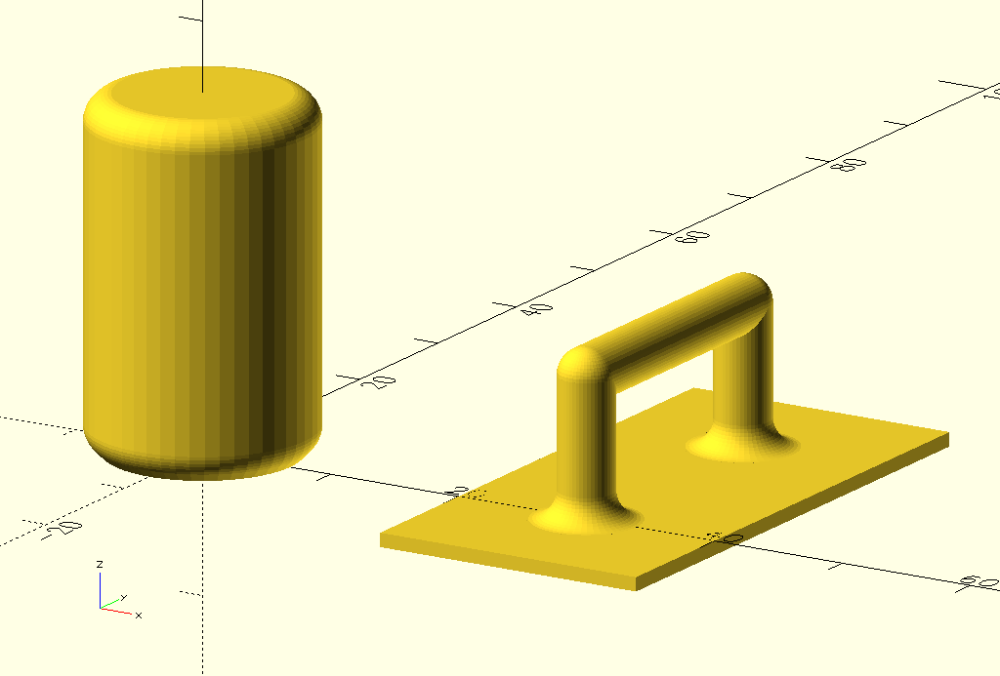
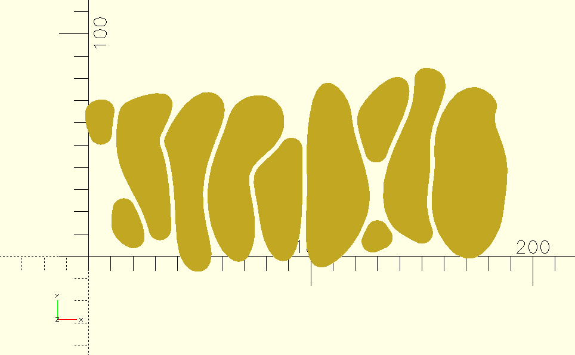

# StoneAgeLib

All sorts of scripts for OpenSCAD.
The scripts are for 3D models for 3D printing.

An important aspect of this library is the CC0 (Public Domain) license.

Note: When using files from this library for a project that is published, then please add those library files to your project or copy the parts of the scripts that your use into your own script. This library might change and a future version might be incompatible with your script.

This library is for a OpenSCAD version of at least 2025 with the features turned on and using "Manifold".

## Documentation

[See the Wiki for the documentation](https://github.com/Stone-Age-Sculptor/StoneAgeLib/wiki).

## Examples

This library has a "Subdivision Font". It is created with control points and the path is made with subdivision.

A function to create a 2D shadow or highlight can make a text look better with multiple colors.

A turtle to draw a shape. Its usage is similar to the Python Turtle graphics.

Textures that are created in a random way (except the checkered steel plate).

A chamfered extrusion.

A cylinder with inward or outward fillet. An optional 45 degrees angle can be added to the bottom.

Using subdivision to create blobs.

